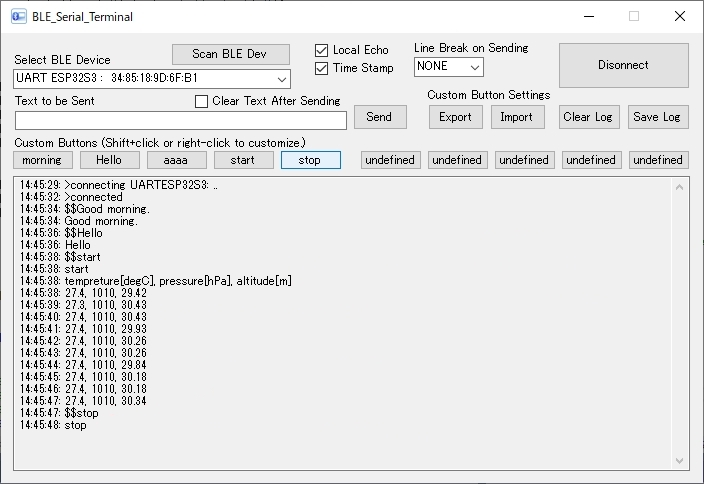

# BLE_Serial_Terminal

### BLE Serial terminal app for Windows PC with custom buttons

* A Windows PC application designed to communicate with a microcontroller using BLE. Communicates using the BLE UART Profile.
* The Windows PC acts as a Central (or Master or Observer) of the BLE connection communication. The other microcontroller acts as a Peripheral (or Slave or Broadcaster).
* Frequently used transmission strings can be registered using the customizable buttons and sent by clicking.
* The number of buttons that can be registered is 10.
* A time stamp can be added to the beginning of the incoming line of text.
* The transmitted string can be included in the received content as a local echo.
* You can save the received contents to a text file.

### Convenient usage

* It is convenient for microcontroller program developers to send commands using BLE serial communications and have the microcontroller perform desired actions in response to those commands. This application can realise this requirement on a Windows PC.

### How to download

* Open the URL [https://github.com/healthywalk/BLE-Serial-Terminal/](https://https://github.com/healthywalk/BLE-Serial-Terminal/)
* Select "Download Zip" from the green button labeled "code".
* "BLE-Serial-Terminal-main.zip" will be downloaded, so unzip it.
* You will find "BLE_Serial_Terminal.exe" in BLE-Serial-Terminal-main \ BLE_Serial_Terminal \ bin \ Release.
* You can put "BLE_Serial_Terminal.exe" in a convenient place and start it by double-clicking.

### How to use

* On the microcontroller, run a program that uses the BLE connection communication.
* Open "BLE_Serial_Terminal".
* Select desired BLE device. If you cannot find your BLE device, use the "Scan BLE Dev" button.
* Check the settings and press "Connect".
* Enter a suitable text string (alphanumeric characters) in the "Text to be sent" field and press the button "Send" to send the string to the microcontroller.
* The received string from the microcontroller is displayed in "Text Received".
* When you press the button "Save Log", you can save the contents of the received text area at that time in a text file.
* To register a character string for a custom button, Shift-click the button you want to register. Up to 36 buttons can be used.
* To exit, press the button "Disconnect" and then the exit button on the upper right.

